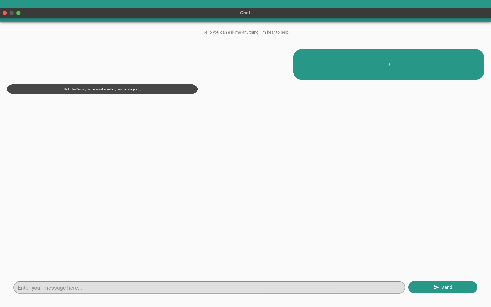

# LLaMA 2 from Scratch and Fine-Tuning with LoRA/QLoRA

This project demonstrates how to implement the **LLaMA 2** architecture from scratch using **PyTorch**, and fine-tune the model with custom datasets using **LoRA (Low-Rank Adaptation)** and **QLoRA techniques**. A graphical interface is provided using **KivyMD**, enabling easy interaction with the fine-tuned model.

---

## Table of Contents

1. [Overview](#overview)  
2. [Key Features](#key-features)  
3. [Links and References](#links-and-references)  
4. [Setup and Installation](#setup-and-installation)  
5. [Model Fine-Tuning Steps](#model-fine-tuning-steps)  
6. [KivyMD Interface](#kivymd-interface)  
7. [Results and Model Usage](#results-and-model-usage)  

---

## Overview

The main objectives of this project are:  
1. To implement **LLaMA 2** architecture from scratch, covering all core components like Rotary Positional Embedding, RMSNorm, Multi-Query Attention, Grouped Query Attention (GQA), SwiGLU Activation, and KV Caching.  
2. To fine-tune the **LLaMA 2-7B-chat** model on a custom dataset using parameter-efficient techniques like **LoRA** and **QLoRA**.  

---

## Key Features

- **Model Implementation**:
  - Key techniques: Rotary Positional Embedding, Grouped Query Attention, RMSNorm, SwiGLU, and more.
  - Optimized inference strategies:  Top-P.
  
- **Fine-Tuning**:
  - Dataset: [mlabonne/guanaco-llama2-1k](https://huggingface.co/datasets/mlabonne/guanaco-llama2-1k) (1,000 samples formatted for LLaMA 2).
  - Techniques: LoRA and QLoRA to reduce computational overhead.

- **Deployment**:
  - Fine-tuned model uploaded to [Hugging Face](https://huggingface.co/entbappy/Llama-2-7b-chat-finetune/commit/bec89c5a59d14d2a8d656911ade2bf73041b5707) for accessibility.

- **Interface**:
  - A GUI built with **KivyMD** for user-friendly interactions.
  - ### Snapshot of the Interface
    


---

## Links and References

1. **LLaMA 2 Architecture Implementation**  
   - [Coding LLaMA 2 from Scratch (YouTube)](https://www.youtube.com/watch?v=oM4VmoabDAI&t=1156s)

2. **Fine-Tuning Tutorial**  
   - [Fine-Tuning with LoRA and QLoRA (YouTube)](https://www.youtube.com/watch?v=oM4VmoabDAI&t=1156s)  
   - [Fine-Tuning Notebook (Google Colab)](https://colab.research.google.com/drive/1bvmuV93BSJBYyDZ8jzNDitZYeQ6tZ5nz?usp=sharing)

3. **LLaMA 2 Weights**  
   - [Meta LLaMA 2 Weights on Hugging Face](https://huggingface.co/meta-llama/Llama-2-7b/tree/main)

4. **Dataset**  
   - [Guanaco LLaMA 2 Dataset (Hugging Face)](https://huggingface.co/datasets/mlabonne/guanaco-llama2-1k)

---

## Setup and Installation

### Prerequisites

- Python 3.8+
- Google Colab (for fine-tuning)
- KivyMD (for GUI interface)
- [Hugging Face CLI](https://huggingface.co/docs/huggingface_hub/quick_start#login)

### Installation Steps

1. Clone the repository:
   ```bash
   git clone https://github.com/hashit4032/App_llama_2_7B.git
   cd App_llama_2_7B
   ```

2. Install dependencies:
   ```bash
   pip install -r requirements.txt
   ```

3. Setup Hugging Face CLI:
   ```bash
   huggingface-cli login
   ```

4. (Optional) Run the GUI interface:
   ```bash
   python main.py
   ```

---

## Model Fine-Tuning Steps

### Fine-Tuning Overview

1. **Load Dataset**:
   - Use the preprocessed dataset: [mlabonne/guanaco-llama2-1k](https://huggingface.co/datasets/mlabonne/guanaco-llama2-1k).

2. **Set Parameters**:
   - Load LLaMA 2 in 4-bit precision to optimize memory usage.
   - Use LoRA configuration with the following settings:
     - `lora_r`: 64
     - `lora_alpha`: 16
     - `lora_dropout`: 0.1

3. **Train the Model**:
   - Use one epoch with a batch size of 4.
   - Train using the Hugging Face Trainer API.

4. **Save and Upload**:
   - Merge LoRA weights with the base model and upload it to Hugging Face.

### Detailed Process

For step-by-step guidance, refer to the [Colab Notebook](https://colab.research.google.com/drive/1bvmuV93BSJBYyDZ8jzNDitZYeQ6tZ5nz?usp=sharing).

---

## KivyMD Interface

The interface allows easy interaction with the fine-tuned model. Users can input prompts and get generated responses directly within the GUI.  

### Running the Interface

```bash
python interface.py
```

---

## Results and Model Usage

### Model Access

The fine-tuned model is available on Hugging Face:
- [LLaMA-2-7B-Chat-Finetune](https://huggingface.co/entbappy/Llama-2-7b-chat-finetune)

### Sample Inference

To generate text:
```python
from transformers import pipeline

model_name = "entbappy/Llama-2-7b-chat-finetune"
pipe = pipeline("text-generation", model=model_name)

prompt = "<s>[INST] What is a large language model? [/INST]"
result = pipe(prompt)
print(result[0]['generated_text'])
```

---

## Acknowledgments

Special thanks to the following resources for enabling this project:  
- [Meta AI's LLaMA 2](https://huggingface.co/meta-llama/Llama-2-7b/tree/main)  
- [Hugging Face Datasets and Transformers Libraries](https://huggingface.co/)  
- [Google Colab](https://colab.research.google.com/)  

